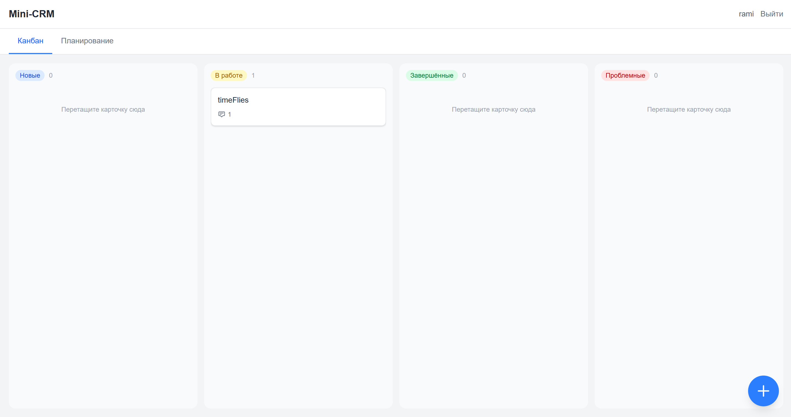
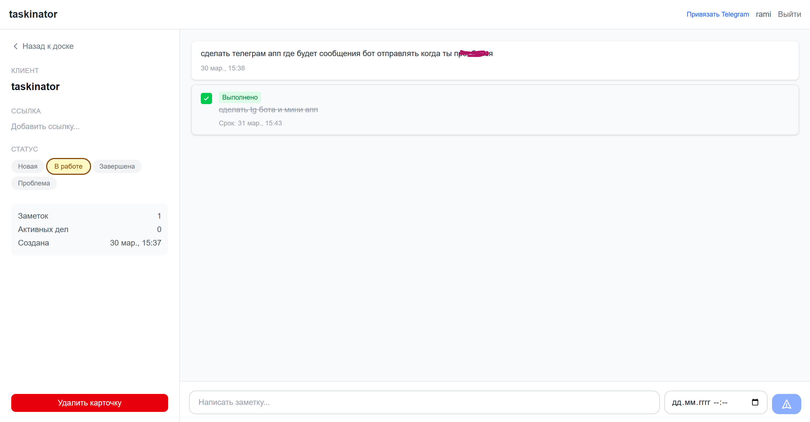

# 🚀 Taskinator


**Минималистичная CRM-система с канбан-доской, заметками и push-уведомлениями**

> 🌐 **Демо:** [taskinator-seven.vercel.app](https://taskinator-seven.vercel.app/)

Taskinator — это легковесная CRM, созданная для управления клиентами и сделками в одном окне. Без сложных настроек, без перегруженного интерфейса — только то, что нужно для работы. Я всю жизнь страдаю от перегруженности таких приложений — решил сделать для себя и жены облегчённую версию, теперь им пользуется уже 10 человек

---

## ✨ Возможности

- **Канбан-доска** — визуальное управление карточками с drag-and-drop перетаскиванием между колонками (Новые → В работе → Завершённые / Проблемные)
- **Планирование** — отдельная вкладка с делами, сгруппированными по срокам: просроченные, сегодня, завтра, ближайшие 7 дней
- **Единая карточка клиента** — заметки и дела в одном месте в формате чата
- **Push-уведомления** — браузерные уведомления приходят даже при закрытой вкладке; дела повторяются каждые 3 часа в рабочее время, пока не будут отмечены выполненными
- **Авторизация** — регистрация и вход по email, каждый пользователь видит только свои данные
- **CI/CD** — автодеплой на Vercel при каждом пуше в main

---

## 🛠 Стек технологий

| Слой | Технология |
|------|-----------|
| **Фреймворк** | [Next.js 16](https://nextjs.org/) (App Router) |
| **Язык** | [TypeScript 5](https://www.typescriptlang.org/) |
| **UI** | [React 19](https://react.dev/) + [Tailwind CSS 4](https://tailwindcss.com/) |
| **Архитектура** | [Feature-Sliced Design](https://feature-sliced.design/) |
| **ORM** | [Prisma 7](https://www.prisma.io/) |
| **База данных** | [PostgreSQL](https://www.postgresql.org/) ([Neon](https://neon.tech/) — serverless) |
| **Авторизация** | [NextAuth.js](https://next-auth.js.org/) (Credentials Provider + JWT) |
| **Drag & Drop** | [@dnd-kit](https://dndkit.com/) |
| **Push-уведомления** | Web Push API + Service Worker |
| **Деплой** | [Vercel](https://vercel.com/) |
| **Cron** | [cron-job.org](https://cron-job.org/) — проверка напоминаний каждую минуту |

---

## 🔧 Технические решения

**LCP 10s → 0.7s**  убрал client-side fetch на первой загрузке: dashboard теперь серверный компонент, карточки приходят с HTML через Prisma напрямую.

**Hydration mismatch от dnd-kit** - библиотека генерировала разные `aria-describedby` на сервере и клиенте. Решил добавив стабильный `id="kanban"` на `DndContext`, что делает идентификатор детерминированным на обоих сторонах.

**Push-уведомления без Vercel Cron** - Vercel Hobby не позволяет запускать cron чаще раза в день. Вынес проверку на внешний [cron-job.org](https://cron-job.org/), который дёргает защищённый Bearer-токеном endpoint каждую минуту.

**Кэш вкладки "Планирование"** - данные загружаются один раз при первом открытии вкладки и хранятся в родительском компоненте, повторные переключения мгновенные.

---

## 📐 Архитектура (FSD)

Проект построен по методологии **Feature-Sliced Design** (не очень строго — для небольшого проекта):

```
src/
├── app/              # Next.js App Router — страницы и API-роуты
├── widgets/          # Составные блоки (канбан-доска, колонки, планирование)
├── features/         # Пользовательские сценарии (создание карточки, drag-and-drop, auth)
├── entities/         # Бизнес-сущности (card, note, reminder)
└── shared/           # Переиспользуемый код (UI-kit, утилиты, конфиги)
```

---

## 📄 Лицензия

MIT
